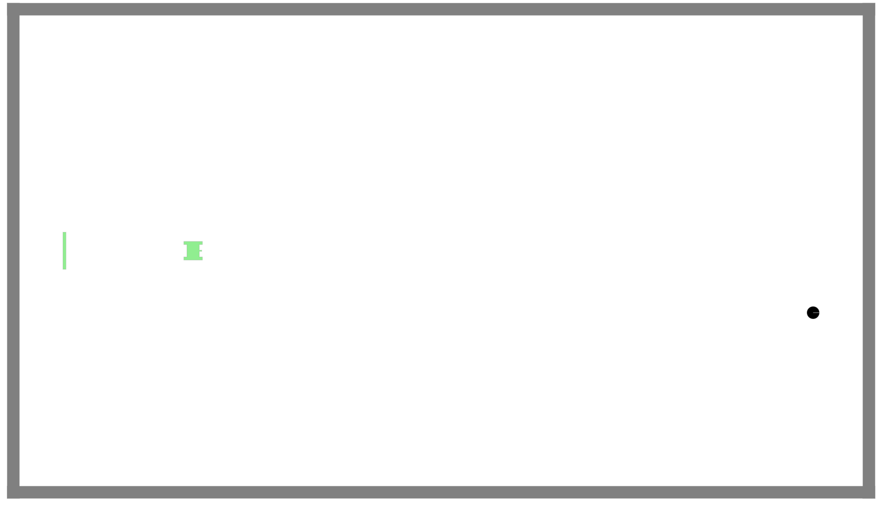
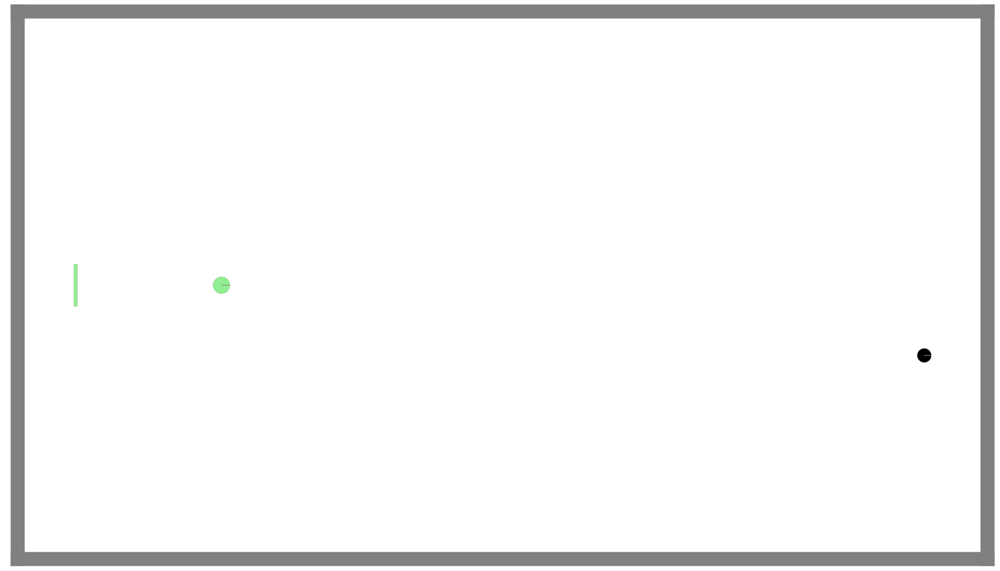
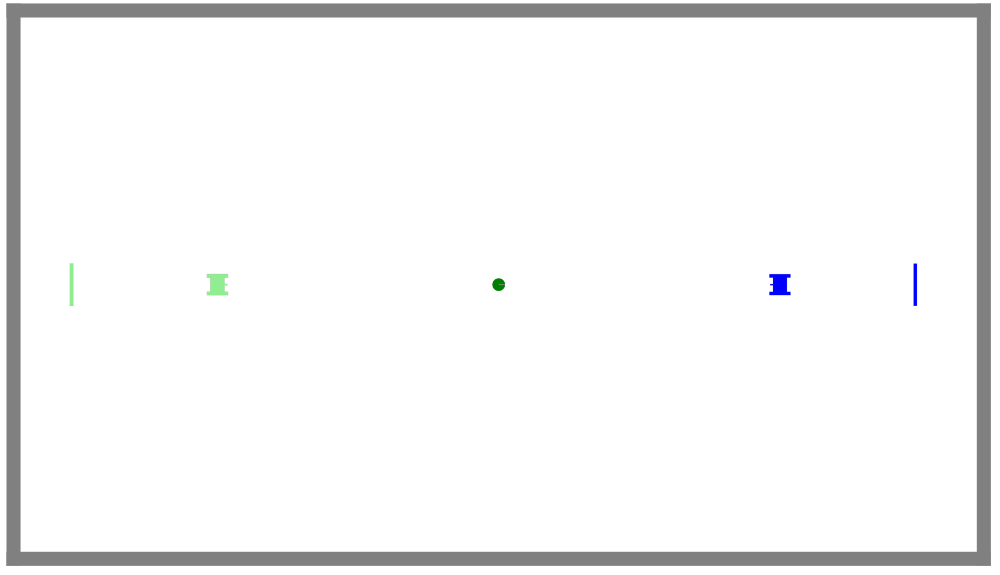

# EEP520-Final_Proj
A 1- or 2- player robot soccer game (with shooting).

The goal of this project was to create a game that could be played with one or two players - on a single computer - that used several of the latest enviro features, including: 
- omnidirectional agents
- dynamically adding/removing agents
- buttons
- keyboard front end events
- invisible agents
- collisions
- agent constraints, such as attaching

# Challenges

# Installation
Clone the EEP520-Final_Proj repository and make it your working directory.
Then, run 

```bash
docker run -p80:80 -p8765:8765 -v $PWD:/source -it klavins/enviro:v1.5 bash
```
From there, compile with
```bash
make
```
Start the enviro server with 
```bash
esm start
enviro
```
Then, navigating to http://localhost in any web browser will bring up the project window.

# Running
The game features single player and two player modes. The mode is selected with the buttons in the top right of the screen.

Single Player:
For single player mode, you may select between two fighters. The first is a tank that moves forward or backward and turns like a typical car. The second is a spaceship that can move in any direction. Both fighters fire their weapons in the direction you are facing.

The objective is to protect the goal from the attacking enemy. Your player is moved with the w,s,a,d keys and can fire with the q key. Shoot the enemy to protect the goal. You will gain points for each enemy you kill! The game is lost when the enemy reaches the goal.


Single Player Mode: Fighter 1


Single Player Mode: Fighter 2

Two Player:
In two player mode, both players use the tank robot. Player 1 (green) moves with w,s,a,d and fires with q. Player 2 (blue) moves with i,j,k,l and fires with /. The objective is to score the ball in the other players goal. The ball will attach to the tank when they come in contact. If shot while holding the ball, a player will drop the ball and will be frozen for a couple seconds. First player to 3 wins!


Two Player Mode

Notes:
- to change modes, you must stop and rerun enviro
- my high score in single-player mode is 10

# Sources
- https://github.com/klavinslab/enviro

README has an overview of what the goal of the project is
10	README has a description of key challenges and how they were addressed
10	README describes how to install and run the code (assuming the user has docker installed)
10	README describes how to run and/or use the project
5	README acknowedges all sources of information or code used
